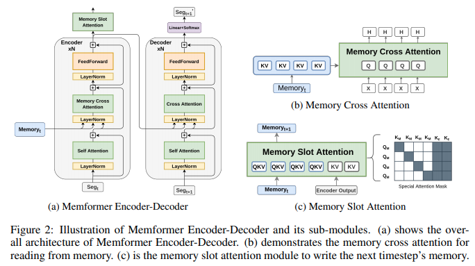

</img>

## Memformer - Pytorch (wip)

Implementation of Memformer, a Memory-augmented Transformer, in Pytorch. It includes memory slots, which are updated with attention, learned efficiently through Memory-Replay BackPropagation (MRBP) through time.

## Install

```bash
$ pip install memformer
```

## Usage

Full encoder / decoder, as in the paper

```python
import torch
from memformer import Memformer

model = Memformer(
    num_tokens = 256,
    dim = 512,
    depth = 2,
    max_seq_len = 1024,
    num_memory_slots = 128,
    num_mem_updates = 2
)

src_seg_1 = torch.randint(0, 256, (1, 1024))
src_seg_2 = torch.randint(0, 256, (1, 1024))
src_seg_3 = torch.randint(0, 256, (1, 1024))

tgt = torch.randint(0, 256, (1, 1024))

enc_out1, mems1,    _ = model(src_seg_1) # (1, 1024, 512), (1, 128, 512), _
enc_out2, mems2,    _ = model(src_seg_2, mems = mems1)
enc_out3, mems3, loss = model(src_seg_3, tgt, mems = mems2)

loss.backward()
```

Encoder only

```python
import torch
from memformer import Memformer

model = Memformer(
    num_tokens = 256,
    dim = 512,
    depth = 2,
    max_seq_len = 1024,
    num_memory_slots = 128,
    num_mem_updates = 2,
    encoder_only = True       # only use encoder, in which output is encoded output
)

src1 = torch.randint(0, 256, (1, 1024))
src2 = torch.randint(0, 256, (1, 1024))

enc1, mems1 = model(src1) # (1, 1024, 512), (1, 128, 512)
enc2, mems2 = model(src2, mems = mems1)
```

## Citations

```bibtex
@inproceedings{
    anonymous2021memformer,
    title={Memformer: The Memory-Augmented Transformer},
    author={Anonymous},
    booktitle={Submitted to International Conference on Learning Representations},
    year={2021},
    url={https://openreview.net/forum?id=_adSMszz_g9},
    note={under review}
}
```
